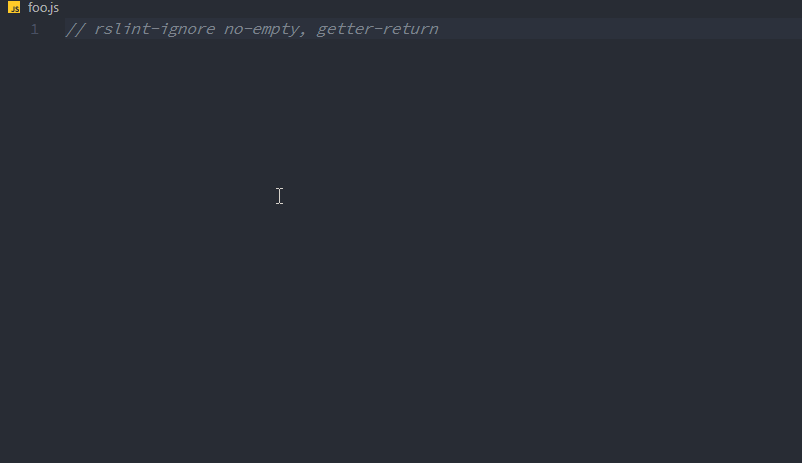
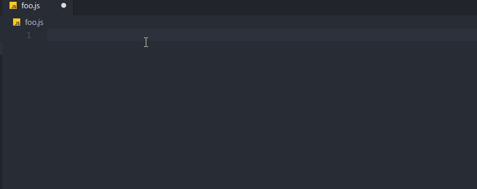
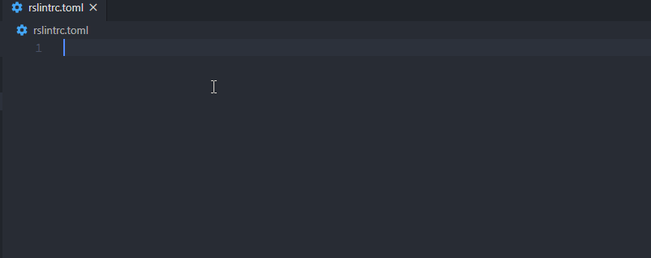

# v0.3.0

{Date}

**Commit**: xxxxxx

**Release**: xxxxx

## New Features

### TypeScript support

RSLint will now automatically detect `.ts` files and lint them. The parser also received
changes to parse TypeScript and issue early errors for when TypeScript is attempted to be used in JavaScript files

### Efficiency

RSLint now consumes approximately 800% less memory while parsing and parses and lints 1050%+ faster, this is
especially prominent on very large files. You can find explanations on how this was done [here](###Parser).

### Directive rework and Autocompletion

The directive parsing system has been rewritten and reworked from the ground up, this not only allows us to easily
add new directives with minimal effort, but it allows us to semantically define the makeup of a directive. This system
has allowed us to add some features which other linters severely lack, including but not limited to:

#### Hover info for directives



#### Autocompletion for directives



#### Accurate and descriptive errors for directives

### Config Autocompletion

RSLint now generates json schemas for its config which it links for `rslintrc.json` through VSC's autocompletion system. We
now also embed a TOML parser as well as completion logic for TOML in the LSP, this means `rslintrc.toml` now has autocompletion:



### Other features

- `rslintrc.json` is now accepted as a config file on top of `rslintrc.toml`, json will be chosen over
  toml if two config files exist.

- The CLI now produces consistent exit codes:  
  `-1`: Linting was unsuccessful because of an internal error  
  `0`: Linting was successful and there are no errors (but there may be warnings)  
  `1`: Linting was successful and there is at least one error  
  `2`: Linting could not be done because of a config or CLI error (e.g. invalid glob pattern)

- The CLI now accepts multiple glob patterns instead of only one

- Added an alternative formatter called "short" for diagnostics similar to ESLint:


- Added a way to configure the formatter through the cli using `-F` or `--formatter`

- Added a way to configure the formatter through the config using the `errors` key:

```toml
[errors]
formatter = "short"
```

- Added the `infer` subcommand to infer style for the project and output style rules to match it

- Added the `rules` subcommand to show all rules

- Reduced memory usage significantly by switching to an alternative backing for syntax nodes

## Changes

- The CLI's binary is now `rslint` instead of `rslint_cli`

## Fixes

- Fixed `/\u{0}/ª\u{80}` panicking
- Fixed `switch {` infinitely recursing
- Fixed infinite recursion with

```js
try{}
catch(){
finally{}
```

- Fixed "redundant strict mode declaration" having a single secondary label instead of a primary label.

## Internal improvements

### Core

- Added `util::StyleExt` for stylistic linting
- Added `Fixer::delete_multiple`
- Added more functions to `util::StyleExt`
- Added `RuleCtx::dummy_ctx`
- Added `Inferable` to define rules which can have their options inferred from nodes
- Added benchmarks for linting a file
- Moved util from a file to its own directory
- Switched to an alternative way of parsing directives using predefined instructions and a custom "parser"
- Rewrote the directive parsing logic to use a custom parser and some instructions

### CLI

- Made all fields of config public
- Added the `rules` subcommand to show all available rules
- Added `JsFile::parse`
- Changed the parameters of `FileWalker::from_glob` from `Paths` to a generic `IntoIterator`
- Added the `infer` function
- Added `-Z` developer flags (`dumpast`, `tokenize`, `help`)
- Moved config handling to `rslint_config`

### Parser

- Added `util::contains_js_whitespace`
- Made `cur_event_pos` and `token_pos` private in favor of a specialized checkpoint struct
- Changed `rewind` to take a Checkpoint
- Added `Syntax` to specify file syntax
- Added `syntax::typescript`
- Added the `stop_on_r_curly` parameter to `block_items`
- Added a new parameter to `Parser::new`
- Fixed `parse_marker` panicking on preceded markers which are later abandoned
- Added a Checkpoint struct to easily backtrack (rewind) the parser
- Renamed `TreeSink::error` to `TreeSink::errors`
- `Parser::finish` now returns the errors that occurred alongside the events
- `process` now takes the errors produced
- Removed `Event::Error` to reduce memory usage of a single event from 200 bytes to 24 bytes, significantly
  improving memory usage.
- Removed most of the usage of `parse_marker` which was over 90% of the parser's run time.
- Improved hashing of nodes in `rslint_rowan`, improving speed by about 36%
- Switched the backing of `TokenSet` from `u128` to `[u128; 2]` to accomodate tokens with a value over 128

### LSP

- Added hover info for directives
- Added autocompletion for directives
- Switched to a custom fork of tower-lsp
- Added toml autocompletion for the config
